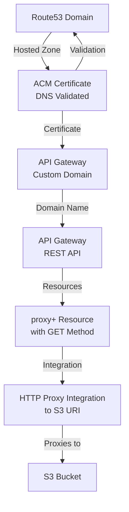

# Terraform AWS API Gateway → S3 Proxy

This Terraform project provisions an AWS API Gateway that acts as a **proxy** to an S3-compatible HTTP endpoint (e.g., Amazon S3, MinIO, or any object store), with a **custom domain**, **TLS certificate**, and **Route53 DNS record**.
---
## 🧱 Architecture

## 🚀 Features

- ✅ API Gateway with `{proxy+}` GET method
- ✅ HTTP Proxy integration to a given URI (e.g., S3 bucket URL)
- ✅ Custom domain name support via AWS ACM
- ✅ Automatic DNS record creation with Route 53
- ✅ Modular and reusable Terraform code

---
